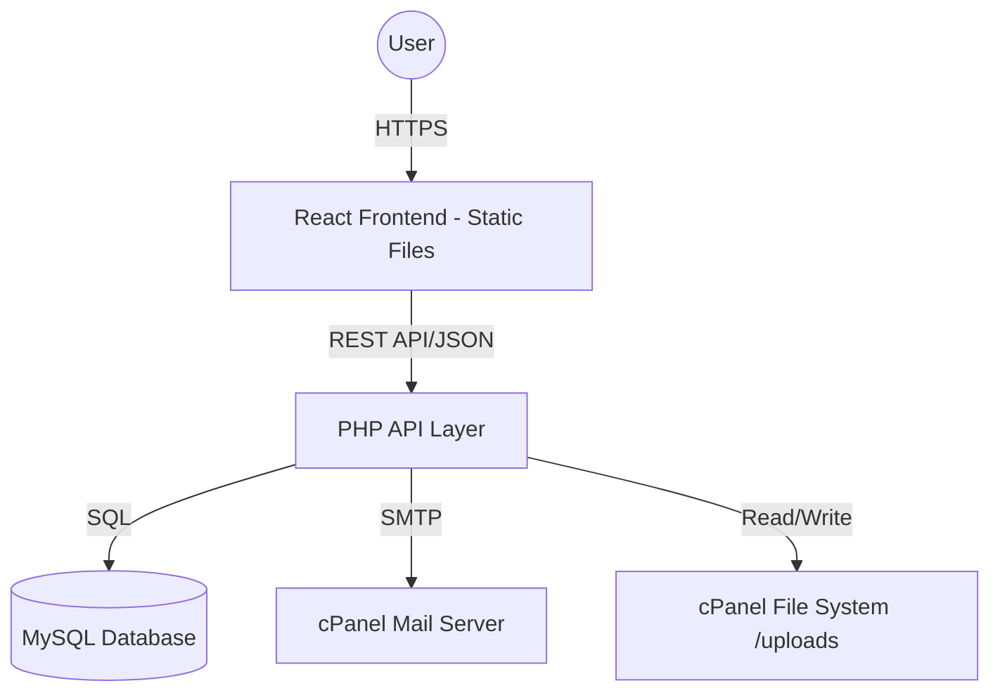

# System Architecture

## Overview
The system follows a decoupled architecture where the Frontend (React) communicates with the Backend (PHP) via a JSON REST API. This ensures a modern SPA experience while remaining compatible with standard PHP/MySQL hosting.

## Component Diagram

## Data Layer (MySQL)
- `users`: id, email, password_hash, role, created_at
- `products`: id, name, description, price, category_id, stock, status, images (JSON or separate table), created_at
- `categories`: id, name, slug
- `orders`: id, user_id, status, total_amount, delivery_charge, district, thana, address, phone, payment_method, created_at
- `order_items`: id, order_id, product_id, quantity, unit_price
- `reviews`: id, product_id, user_id, rating, comment, is_verified, created_at

## Backend Structure (Proposed)
- `/api`
  - `/auth`: Login, Register, Verify JWT
  - `/products`: CRUD logic
  - `/orders`: Order submission, history, status updates
  - `/uploads`: Image storage directory
  - `config.php`: DB connection and JWT secret
  - `functions.php`: Helper utilities (Mail, Response formatting)

## Security
- **JWT**: Stateless authentication for the React app.
- **CORS**: Configured to only allow requests from the site's domain.
- **Input Validation**: Sanitizing all POST/GET data.
- **Bcrypt**: For secure password hashing.

## Deployment Strategy
1. **Frontend**: `npm run build` -> Upload `dist/` contents to `public_html/`.
2. **Backend**: Upload `/api` folder to `public_html/api`.
3. **Routing**: `.htaccess` configuration to handle React's index redirect and API routing.
